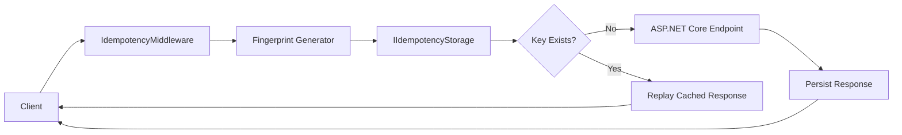
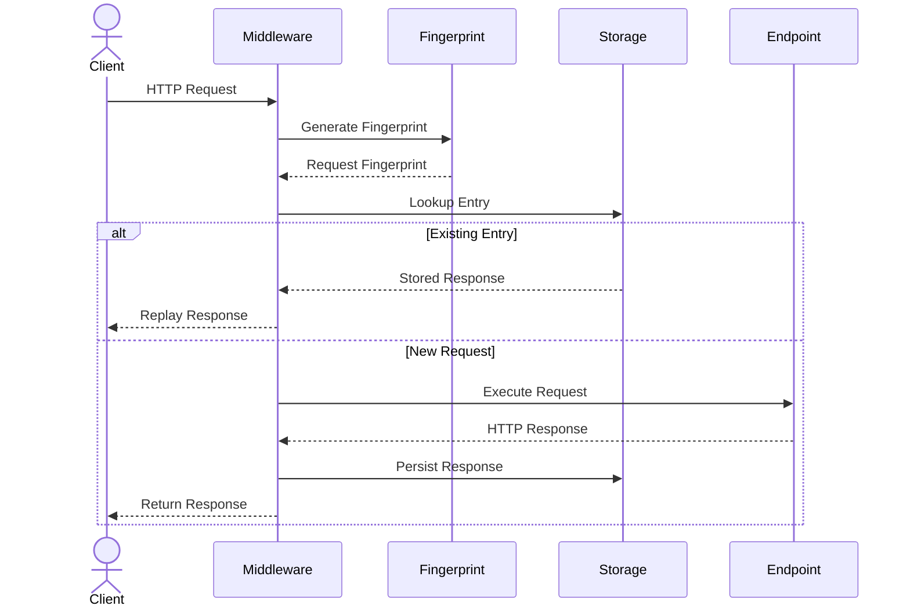
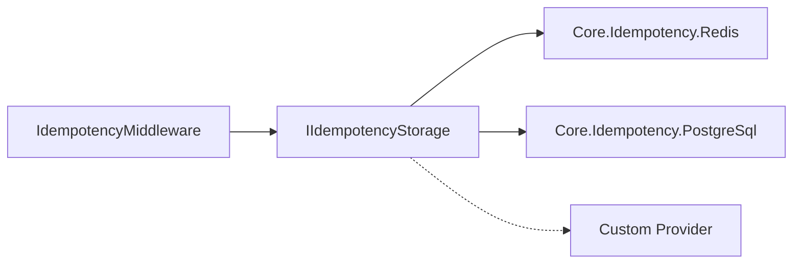

# 🏗️ Architecture

`CoreSystem.Idempotency` is built around a middleware-centric architecture that atomically suppresses concurrent duplicate requests and replays completed responses.

The framework coordinates the idempotency workflow while remaining completely independent from the underlying storage technology.

Instead of allowing every incoming request to reach the application, the middleware intercepts the request, resolves the idempotency key, generates a request fingerprint, and delegates persistence to an implementation of `IIdempotencyStorage`.

This provider-based architecture keeps the core library storage-agnostic while allowing additional storage providers to be introduced without modifying the framework.

---

# 🎯 Design Goals

CoreSystem.Idempotency is designed around a few core principles:

- Prevent concurrent execution for a shared idempotency key.
- Keep the framework independent from storage implementations.
- Detect request modifications through fingerprinting.
- Support pluggable storage providers.
- Keep infrastructure concerns isolated from business logic.
- Allow new providers without modifying the core library.

---

# 🏛️ Architectural Patterns

The framework combines several architectural patterns.

| Pattern | Purpose |
|----------|---------|
| **Middleware** | Intercepts incoming HTTP requests before they reach the application. |
| **Strategy** | Allows different implementations of request fingerprinting and storage. |
| **Provider Pattern** | Delegates persistence to implementations of `IIdempotencyStorage`. |
| **Decorator** | Captures and persists successful responses for future replay. |

These patterns keep the framework extensible while minimizing the impact on application code.

---

# 🧩 Core Components

The framework is composed of the following components.

| Component | Responsibility |
|-----------|----------------|
| **IdempotencyMiddleware** | Coordinates the complete idempotency workflow. |
| **IIdempotencyStorage** | Abstraction responsible for persisting idempotency entries. |
| **IRequestFingerprintProvider** | Computes deterministic request fingerprints. |
| **IIdempotencyKeyResolver** | Resolves the idempotency key from the incoming request. |
| **IResponseCapture** | Captures the generated HTTP response before persistence. |
| **IHttpResponseWriter** | Replays previously stored responses. |

Each component has a single responsibility and can evolve independently.

---

# 🔄 Request Lifecycle

Every request follows the same execution flow.

---

# 🔐 Request Fingerprinting

Before querying the storage provider, the middleware computes a deterministic fingerprint of the incoming request.

The fingerprint may include:

- HTTP method
- Request path
- Query string
- Request body
- Selected HTTP headers

If an existing idempotency entry is found but its fingerprint differs from the incoming request, the middleware throws an `IdempotencyFingerprintMismatchException`.

See **Fingerprinting** for implementation details.

---

# 🗄️ Storage Providers

The middleware never communicates with a storage technology directly.

Instead, it depends exclusively on the `IIdempotencyStorage` abstraction.

Each provider is distributed as an independent package.

Current providers include:

- Core.Idempotency.Redis
- Core.Idempotency.PostgreSql

Additional providers can be introduced by implementing `IIdempotencyStorage`, without requiring changes to `Core.Idempotency`.

---

# ♻️ Response Replay

After a successful request execution, the middleware persists:

- HTTP status code
- Response headers
- Response body
- Request fingerprint
- Expiration metadata

When an identical request is received with the same idempotency key, the stored response is replayed immediately without executing the application endpoint again.

This replays persisted responses across retries and prevents concurrent requests with the same key from executing simultaneously.
