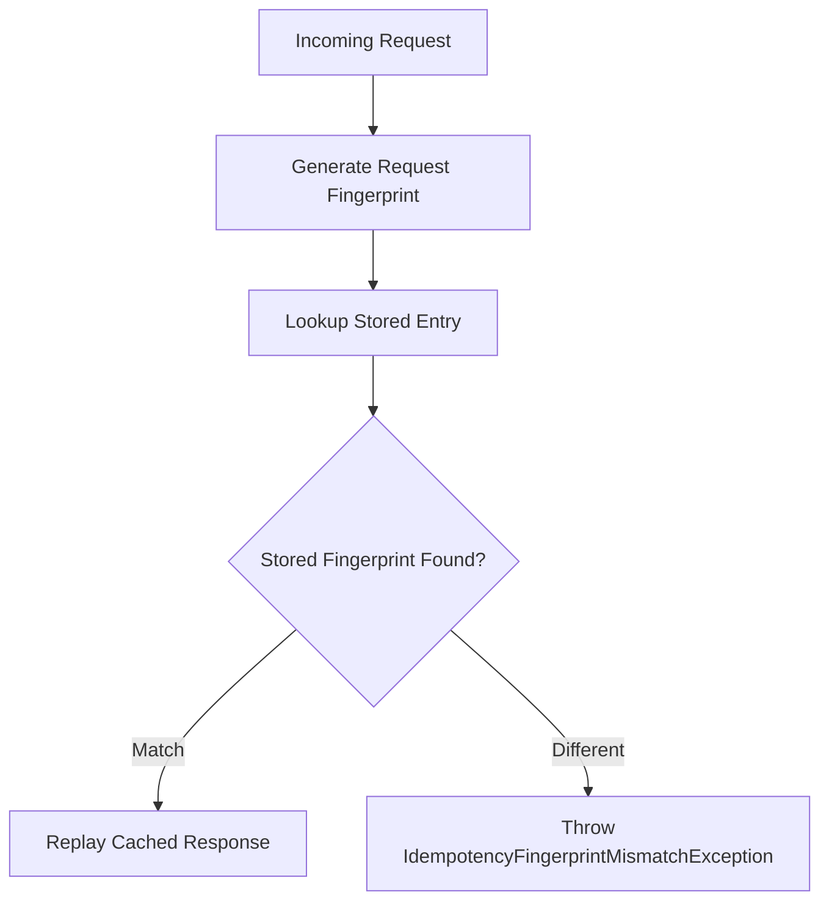

# 🔐 Fingerprinting

Fingerprinting ensures that an idempotency key can only be reused for **the same logical request**.

When an incoming request contains an idempotency key, CoreSystem.Idempotency computes a deterministic fingerprint based on the request contents.

If another request later uses the same idempotency key but produces a different fingerprint, the request is rejected to prevent accidental reuse of the original operation.

---

# Why Fingerprinting?

Without fingerprint validation, an idempotency key could be unintentionally reused for a completely different business operation.

For example, the first request creates an order.

```http
POST /orders
Idempotency-Key: order-123

{
    "productId": 100,
    "quantity": 1
}
```

Later, the client accidentally retries using the same key but changes the payload.

```http
POST /orders
Idempotency-Key: order-123

{
    "productId": 100,
    "quantity": 5
}
```

Although both requests share the same idempotency key, they represent different business operations.

Fingerprint validation detects the change and prevents the second request from being processed.

---

# How It Works

For every incoming request, the middleware performs the following steps:

1. Resolve the idempotency key.
2. Generate a deterministic request fingerprint.
3. Query the configured storage provider.
4. Compare the stored fingerprint with the new fingerprint.
5. Replay the cached response or reject the request if the fingerprints differ.



---

# What Is Included?

By default, the fingerprint is generated from:

- HTTP method
- Request path
- Request body

Optionally, it can also include:

- Query string
- Content-Type
- Selected request headers

These values uniquely identify the logical operation represented by the request.

---

# Customizing the Fingerprint

Fingerprint generation can be customized through `FingerprintOptions`.

```csharp
builder.Services.AddCoreIdempotency(options =>
{
    options.Fingerprint.IncludeQueryString = true;

    options.Fingerprint.IncludeContentType = true;

    options.Fingerprint.IncludedHeaders.Add("X-Tenant-Id");

    options.Fingerprint.IncludedHeaders.Add("X-Region");
});
```

Only explicitly configured headers participate in fingerprint generation.

---

# When Should Headers Be Included?

Include request headers only when they define the business identity of the request.

Good candidates include:

- Tenant identifiers
- Region identifiers
- API version headers

Avoid headers whose values naturally change between retries, such as:

- Date
- User-Agent
- Trace identifiers
- Correlation identifiers

Including volatile headers may cause legitimate retries to be treated as different requests.

---

# Fingerprint Mismatch

If an existing idempotency entry is found but its fingerprint differs from the incoming request, the middleware throws an `IdempotencyFingerprintMismatchException`.

This indicates that the same idempotency key has been reused for a different logical operation.

Applications commonly translate this exception into an HTTP `409 Conflict` response.

See **Errors → Fingerprint Mismatch** for implementation guidance.

---

# Configuration

The fingerprint can be customized through the `Fingerprint` section of `IdempotencyOptions`.

```csharp
builder.Services.AddCoreIdempotency(options =>
{
    options.Fingerprint.Enabled = true;

    options.Fingerprint.IncludeQueryString = true;

    options.Fingerprint.IncludeContentType = true;

    options.Fingerprint.IncludedHeaders.Add("X-Tenant-Id");
});
```

For the complete list of available options, see **Configuration**.

---

# Best Practices

- Generate a unique idempotency key for every logical operation.
- Keep the default fingerprint configuration whenever possible.
- Include only headers that define business identity.
- Avoid volatile headers that change between retries.
- Never reuse an idempotency key for different requests.