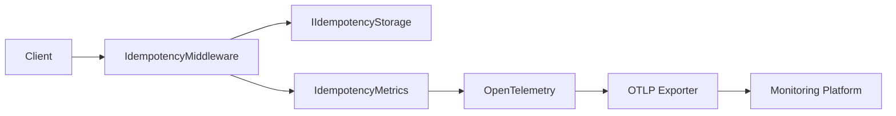

# 📊 Observability

## Storage metrics

`idempotency.payload.size` records the HTTP response body size in bytes (`By`), regardless of whether Redis or PostgreSQL stores additional serialized metadata. Storage write counters and read/write duration histograms include a `provider` tag (`redis` or `postgresql`) so they can be compared and filtered consistently.

`CoreSystem.Idempotency` includes built-in **OpenTelemetry** instrumentation.

The framework automatically publishes metrics describing request processing, response replay, storage activity, and payload characteristics without requiring changes to application code.

Observability is implemented by the middleware itself, providing consistent metrics regardless of the configured storage provider.

---

# Why Observability Matters

Idempotency protects critical business operations, but understanding how those operations behave in production is equally important.

CoreSystem.Idempotency publishes metrics directly from the middleware, providing storage-independent visibility into request processing, response replay, and persistence operations.

Built-in telemetry helps answer questions such as:

- How many idempotent requests are processed?
- How many duplicate requests are detected?
- How often are cached responses replayed?
- How long do storage operations take?
- How many responses are persisted?
- What is the average response payload size?

---

# Architecture



---

# Built-in Metrics

The framework automatically publishes the following metrics.

| Metric | Type | Description |
|----------|------|-------------|
| `idempotency.requests` | Counter | Total idempotent requests processed by the middleware. |
| `idempotency.cache.hits` | Counter | Requests served from the configured storage provider. |
| `idempotency.cache.misses` | Counter | Requests that required normal endpoint execution. |
| `idempotency.response.replays` | Counter | Cached responses replayed to the client. |
| `idempotency.storage.writes` | Counter | Responses persisted by the configured storage provider. |
| `idempotency.storage.read.duration` | Histogram | Duration of storage read operations in milliseconds. |
| `idempotency.storage.write.duration` | Histogram | Duration of storage write operations in milliseconds. |
| `idempotency.payload.size` | Histogram | Size of persisted response payloads in bytes. |

---

# Understanding the Metrics

## Request Flow

Every idempotent request increments:

```text
idempotency.requests
```

If the request is executed normally:

```text
idempotency.cache.misses
```

If a previously stored response is replayed:

```text
idempotency.cache.hits
idempotency.response.replays
```

When a new response is successfully persisted:

```text
idempotency.storage.writes
```

---

## Storage Performance

The framework measures storage latency using histograms.

```text
idempotency.storage.read.duration
idempotency.storage.write.duration
```

These metrics help identify slow persistence operations regardless of the configured storage provider.

---

## Payload Size

The middleware records the size of every persisted response.

```text
idempotency.payload.size
```

This metric is useful for:

- Monitoring storage consumption.
- Detecting unusually large responses.
- Measuring serialization overhead.

---

# Storage Provider Metrics

Storage providers contribute to the same metric set exposed by CoreSystem.Idempotency.

Whether the application uses Redis, PostgreSQL, or a future provider, the published metrics remain consistent.

This allows dashboards, alerts, and monitoring rules to remain unchanged when switching storage implementations.

---

# Registering the Meter

The framework publishes the following OpenTelemetry meter.

```text
CoreSystem.Idempotency
```

Applications only need to register the meter with OpenTelemetry.

```csharp
builder.Services
    .AddOpenTelemetry()
    .WithMetrics(metrics =>
    {
        metrics.AddMeter("CoreSystem.Idempotency");
    });
```

---

# Compatible Platforms

The published metrics can be exported to any OTLP-compatible backend.

| Platform | Supported |
|----------|:---------:|
| Prometheus | ✅ |
| Grafana | ✅ |
| Azure Monitor | ✅ |
| Jaeger | ✅ |
| Elastic | ✅ |
| Datadog | ✅ |
| OTLP | ✅ |

---

# Example Dashboard

Typical dashboards include:

- Total Requests
- Cache Hits
- Cache Misses
- Response Replays
- Storage Read Duration (P95)
- Storage Write Duration (P95)
- Average Payload Size
- Total Storage Writes

*(Grafana dashboard screenshots can be added here.)*

---

# Best Practices

- Monitor the cache hit/miss ratio.
- Track response replay frequency.
- Monitor storage read and write latency.
- Watch for unusually large response payloads.
- Export metrics using an OTLP-compatible backend.
- Configure alerts for abnormal storage latency.
- Reuse the same dashboards across different storage providers.

---

# Related Documentation

- Configuration
- Architecture
- Response Replay
- CoreSystem.Observability
