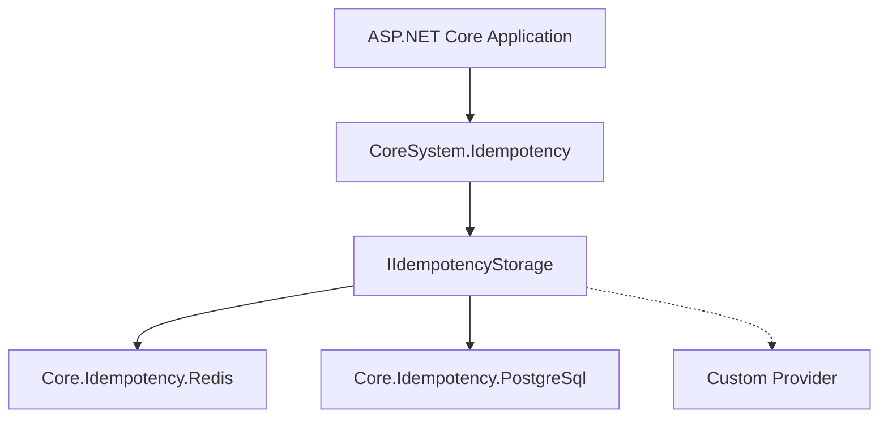

# ⚡ CoreSystem.Idempotency

CoreSystem.Idempotency is a production-ready idempotency library for ASP.NET Core and .NET 8.

It suppresses concurrent duplicate requests and replays completed responses when clients retry because of timeouts, network failures, or duplicate submissions.

The framework provides request fingerprinting, response replay, OpenTelemetry integration, and a provider-based architecture that enables pluggable storage providers.

---

## ✨ Features

- Middleware-based idempotency for ASP.NET Core
- Concurrent duplicate suppression and response replay
- Response capture and replay
- Request fingerprint validation
- Provider-based storage architecture
- Extensible through `IIdempotencyStorage`
- Built-in OpenTelemetry metrics
- Storage-provider independent design

---

## 📦 Package Architecture

CoreSystem.Idempotency contains the middleware and the orchestration logic.

Storage providers are distributed as independent packages.

| Package | Responsibility |
|----------|----------------|
| **CoreSystem.Idempotency** | Middleware, request fingerprinting, response replay, storage abstractions, and orchestration |
| **CoreSystem.Idempotency.Redis** | Redis storage provider |
| **CoreSystem.Idempotency.PostgreSql** | PostgreSQL storage provider |
| **CoreSystem.Serialization** | JSON, MessagePack, and Protocol Buffers serialization |
| **CoreSystem.Http** | HTTP abstractions used by the middleware |
| **CoreSystem.Redis** | Redis connectivity infrastructure used by the Redis provider |
| **CoreSystem.Observability** *(Optional)* | OpenTelemetry metrics, tracing, and diagnostics |
| **CoreSystem.Observability.Abstractions** | Shared observability contracts |

> **CoreSystem.Idempotency** requires a storage provider.
>
> Choose one of the available provider packages:
>
> - **CoreSystem.Idempotency.Redis**
> - **CoreSystem.Idempotency.PostgreSql**

> **Optional:** Install **CoreSystem.Observability** to enable built-in OpenTelemetry metrics and tracing.

---

## 🏛️ High-Level Architecture

---

## 📚 Documentation

- 🚀 [Getting Started](GettingStarted.md)
- ❓ [Why CoreSystem.Idempotency?](Why.md)
- 🏗️ [Architecture](Architecture.md)
- ⚙️ [Configuration](Configuration.md)
- 🗄️ Storage Providers: [Redis](Providers/Redis.md) · [PostgreSQL](Providers/PostgreSQL.md)
- 🛡️ [Delivery Guarantees](Guarantees.md)
- 🔐 [Fingerprinting](Fingerprinting.md)
- ♻️ [Response Caching](ResponseCaching.md)
- 📊 [Observability](Observability.md)
- ❌ [Errors](Errors/idempotency-fingerprint-mismatch.md)
- 🛣️ [Roadmap](Roadmap.md)
